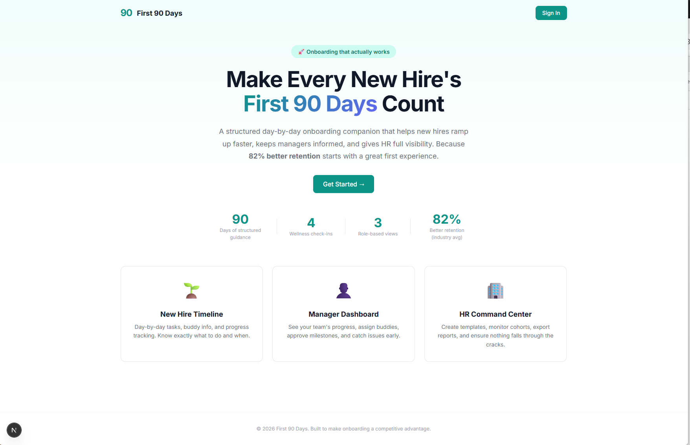
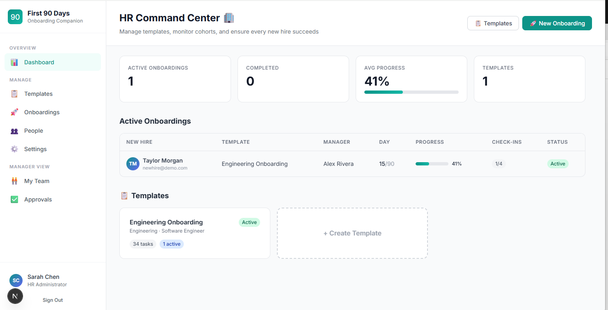
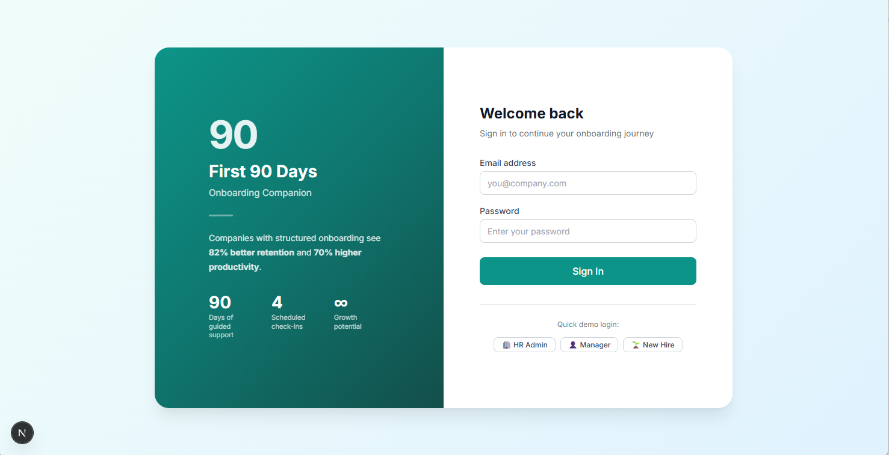

# 🚀 Onward90

<div align="center">
  <p align="center">
    <strong>Make Every New Hire's First 90 Days Count.</strong>
  </p>
  <p align="center">
    
    
    
    
    
  </p>
</div>

---

Onward90 is a structured, day-by-day onboarding companion designed to help new hires ramp up faster, keep managers informed, and give HR full visibility. Because **82% better retention** starts with a great first experience.

[View Documentation](./CONTRIBUTING.md) | [Report Bug](https://github.com/ramailo1/Onward90/issues) | [Request Feature](https://github.com/ramailo1/Onward90/issues)

---

## ✨ Features

- **🗺️ Role-Based Journeys**: Personalized onboarding paths for New Hires, Managers, and Buddies.
- **✅ Daily Tasks & Milestones**: Clear, actionable items to guide new employees through their first 3 months.
- **📊 HR Dashboard**: High-level visibility into entire company onboarding health.
- **🤝 Buddy System**: Integrated "Buddy" touchpoints to ensure social integration.
- **📈 Wellness Check-ins**: Automated pulse checks at Day 7, 30, 60, and 90.

---

## 📸 Visuals

### Landing Page


### HR Admin Dashboard


### Seamless Login



---

## 🛠️ Tech Stack

- **Framework**: [Next.js 15+](https://nextjs.org) (App Router)
- **Database**: [Prisma](https://prisma.io) with SQLite (Local-first)
- **Auth**: [Auth.js (NextAuth v5)](https://authjs.dev)
- **Styling**: Tailwind CSS & Lucide Icons

---

## 🚀 Quick Start

### 1. Prerequisites
- **Node.js**: v18+
- **npm**: v9+

### 2. Installation & Setup
```bash
# Clone the repository
git clone https://github.com/ramailo1/Onward90.git
cd Onward90

# Install dependencies
npm install

# Initialize database
npx prisma generate
npx prisma db push
node prisma/seed.js

# Start development server
npm run dev
```

### 3. Environment Variables
Create a `.env` file:
```env
DATABASE_URL="file:./dev.db"
AUTH_SECRET="your-super-secret-key"
```

---

## 🔑 Demo Accounts

| Role | Email | Password |
| :--- | :--- | :--- |
| **HR Admin** | `hr@demo.com` | `demo1234` |
| **Manager** | `manager@demo.com` | `demo1234` |
| **New Hire** | `newhire@demo.com` | `demo1234` |
| **Buddy** | `buddy@demo.com` | `demo1234` |

---

## 🤝 Contributing
Contributions are what make the open source community such an amazing place to learn, inspire, and create. Any contributions you make are **greatly appreciated**. Please read our [Contributing Guide](./CONTRIBUTING.md) for details.

## 📄 License
Distributed under the MIT License. See `LICENSE` for more information.

---

<p align="center">
  Built with ❤️ for better onboarding.
</p>

